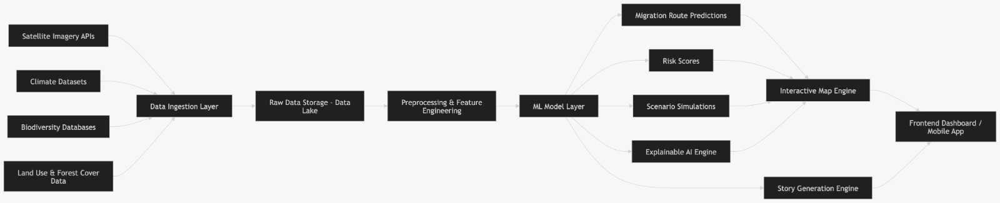

# MISA — Migration Intelligence & Story Atlas

> *Track the journey. Understand the change. Tell the story.*

MISA is an open-source AI/ML platform that tracks historical animal migration patterns, predicts future routes, and connects those shifts to real-world environmental events — presented in a way anyone can understand, not just scientists.

---

## Why MISA?

Every year, billions of animals migrate across the planet. Their routes are shifting. Their timing is changing. Their populations are declining. The data exists — but it lives in research databases, academic papers, and government reports that most people never see.

MISA bridges that gap. It takes raw GPS tracking data, climate records, and world news — and turns them into live maps, forward-looking predictions, and human-readable stories about what's happening to the natural world.

---

## What It Does

| Feature | Description |
|---|---|
| 🗺️ **Migration Atlas** | Animated world map of historical migration routes across species and decades |
| 🤖 **Route Prediction** | AI-predicted future migration corridors with uncertainty confidence zones |
| ⚠️ **Anomaly Detection** | Real-time flagging of unusual migration seasons compared to historical baselines |
| 📰 **Story Feed** | AI-curated cause-and-effect cards linking world events to migration shifts |
| 🌍 **Habitat Risk Map** | Geographic suitability scoring and corridor bottleneck detection |

---

## System Architecture



---

## Tech Stack

**Frontend:** React 19, TypeScript, Tailwind CSS 4
**Backend:** Node JS, Express JS, MongoDB 
**ML:** PyTorch , XGBoost , sentence-transformers , FAISS  
**Data:** Movebank , GBIF , NASA Earthdata , WorldClim  
**Hardware:** AMD Instinct MI300X , EPYC 9004 , ROCm

---

## Project Structure

```
misa/
├── frontend/               
├── backend/                
├── ml/
│   ├── route_predictor.py     
│   ├── habitat_scorer.py      
│   ├── anomaly_detector.py    
│   ├── story_linker.py        
│   ├── pipeline.py                   
│   └── requirements.txt
├── docs/
│   ├── ML.md                         # AI/ML model documentation
│   └── AMD.md                        # AMD hardware integration guide
└── README.md
```

---

## Quickstart

```bash
# 1. Clone the repo
git clone https://github.com/your-username/misa.git
cd misa

# 2. Install ML dependencies
pip install -r ml/requirements.txt

# 3. Set your API key (for story generation)
export LLM_API_KEY=your_key

# 4. Run the full ML pipeline demo
python ml/pipeline.py

# 5. Start the backend server
uvicorn backend.server:app --reload --port 8000

# 6. Start the frontend
cd frontend && npm install && npm run dev
```

---

## The 4 ML Models

```
GPS + Climate Data
      ↓
  [ Model 1 ]  Route Predictor       →  Future waypoints + confidence zones
      ↓
  [ Model 2 ]  Habitat Scorer        →  Suitability scores + risk zones
      ↓
  [ Model 3 ]  Anomaly Detector      →  Unusual season flagging
      ↓
  [ Model 4 ]  Story Event Linker    →  Cause-effect story cards
```

See [`docs/ML.md`](docs/ML.md) for full architecture, inputs/outputs, and training details.

---

## Data Sources

| Source | What It Provides |
|---|---|
| [Movebank](https://www.movebank.org) | Animal GPS tracking data |
| [GBIF](https://www.gbif.org) | Species occurrence records |
| [NASA Earthdata](https://earthdata.nasa.gov) | Climate and land cover rasters |
| [WorldClim](https://www.worldclim.org) | Temperature and precipitation grids |
| [NOAA](https://www.noaa.gov) | Sea surface temperature |
| [WDPA](https://www.protectedplanet.net) | Protected area boundaries |

---

## AMD Hardware Support

MISA's ML pipeline runs natively on AMD hardware via ROCm — no code changes required.

| Component | AMD Product |
|---|---|
| LSTM Training | Instinct MI300X / MI325X |
| LLM Story Layer | Instinct MI355X |
| Data Pipeline | EPYC 9004 Series |
| Software Stack | ROCm · MIOpen · rocBLAS · AMD Quark |

```bash
# Switch from CUDA to AMD ROCm in one line
pip install torch --index-url https://download.pytorch.org/whl/rocm6.0
```

---

## Species Covered (v1)

- 🐦 Arctic Tern · Bar-tailed Godwit · White Stork
- 🦋 Monarch Butterfly
- 🐘 African Elephant · Wildebeest · Zebra
- 🐋 Humpback Whale · Southern Right Whale
- 🐢 Leatherback Sea Turtle

---

## Roadmap

- [x] Core ML pipeline (all 4 models)
- [x] Interactive migration map prototype
- [ ] Movebank live data integration
- [ ] Real-time news event indexing (GDELT / NewsAPI)
- [ ] Multi-species simultaneous tracking
- [ ] Mobile app
- [ ] Citizen science contribution layer
- [ ] School & educator toolkit


## License

Apache License — see [LICENSE](LICENSE) for details.

---